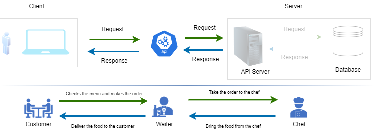

icon: material/api

# API - Cheat Sheet

## What is an API?

- API stands for - Application Programming Interface
- A set of protocols that allow different applications to communicate and exchange data.

## Why do we use it?

- API helps to integrate the existing functionality with a new application.
- Avoid code to be written from scratch
- Helps in sharing data

## How it works?

<!--  -->

<iframe frameborder="100" style="width:100%;height:100%;" src="https://viewer.diagrams.net/?tags=%7B%7D&highlight=0000ff&edit=_blank&layers=1&nav=1&title=#R7VnbbuM2EP0avxokdX%2BML9kWaIGgWaCPAS0xMhFZVCn6knx9h7rYEqnY3qzcFnADx5YOyRF5znBIjibOfHP4Jmmx%2Fl0kLJsQlBwmzmJCiItD%2BNbAewN4fg2kkic1hE7AM%2F9gNYhbdMsTVjZYDSkhMsWLPhiLPGex6mFUSrHvV3sVWdIDCpoyC3iOaWajf%2FJErWs09NAJ%2F4XxdN0%2BGaOmZEXjt1SKbd48Lxc5q0s2tDXTVC3XNBH7DuQsJ85cCqHqq81hzjLNap%2Bxx09Kj12WLFdXNWj7od7bYbMEWGhuq547s7XaZHCH4fI1E%2FuHnMNAuMhbjGfZXGRCVgYcvKKYwUhmpZLijXVKEPKXD9CVmd3Npuf64R2g6fQ3JjZMyXeoIFkGj971JaKN0umx3rHpk%2BDwCIIap3TcqG7S%2BCT2nb6JUmxlzJpWXeIMQ%2BDN5w0pKlOmLENw0RnPCap0GdaI1IZ3NNs2w7Y06wiU0HLNdEsEN%2Fs1V6wsaKzr7WGW2mqRMPCWg2q9Vn9QUuhBVMPyZvBBU4Rg8HM01WOeo4kHtedVAa5gYqDRIFqZMGtGnxgOqtZQPmAEGxgJjbrwcWY7JhWHyf0bXbHsSZS8ceCVUEpsoALNeKqBGHySyU6Lh6ZACU0fzNhCs7k5pDrqTd%2B2KyZzBjRPeawtzgr5a3WxoAU%2F5%2BvaPjuc9fbWawPcdzbcONv%2BFJe8oIbWnZDkh5%2FPj55DnvE%2B57L30bKo4%2B8rP2jXmxVMcniQZnEB1iBgs6cT1A0nFunHgIhMX9ZuzPP0u1Zh4QAAQUgHi%2FZ3wTcpDCbjK%2FimsQ4SLwmX0DOhR%2Fy4LZmclrt0HEkCp69IS0tHERxOPVuTdvn4GU38y5q0bppQRUtggLXR4LkfDTpajMGKiwxHtWnx0YCjjkBKNP5K5iMa4WAoNpJF4CP0b65kxFzJnOhrK5nj4fOGxlvJgst%2BezFMdxQcDtB2SOmJ1ziCoTRCs%2BUjGQjv9GMr2TSjRW28WgqZXO5YvSKONG%2BOAf04byJr3kT%2BbYJJeFmUNtJ2uB8KujFE%2Bhcqlb4Um2ILRJVw%2FcwkMPHyXezhG5PwAP%2FTIh8pEHuOuTb6FnXhQMgJR6AOe%2BPHnP%2Fy7tlrj3THTa9B4rUxx3WC84bGizmtO9zLuuC6Zjj3v6aRh80Fxr%2BZRsF9zaMAG4dHL%2FyaRj7G5w2NqFF4X%2FPINzVy3K9pFODgvKERNYqstfwP9teWlcrSDlZXdeEoZm6vNjxJdPOZZCX%2FoKvKFLLyA%2FqwTbcKtm5VQg9fswNroBG2A8Q3dlLI3g60VbrbAeJ%2F7iDXbgfapN4d0%2B%2BapxJkZypuRj%2B%2Be%2Fp9xzh%2F%2F5PeTwboLwuRl%2Bx%2B%2BG%2BJPO5r7fxHQG7Ev52puzv%2BXdc8V9j%2BfzP%2BPYt%2Fi%2FeL2Y3hlEZHJzM%2FsaIlj6eyyr%2BeSCUnVmv22xdYVSK1loboa54nNdse3AidYVWauuDs1usH5kP%2FvBgFlhp4KG8djZC3Ju7%2F08HaDPl2Wulm0%2BGKJPW9TQeP9MPTwHwg4cDyfHyz%2FAOCwO3pNXJ9lji9pXeWfwM%3D"></iframe>
## Use cases

Imagine you’re developing a food delivery app similar to Zomato or Swiggy. You want to incorporate a map (using Google Maps) that displays the registered users’ locations and the distance between their location and the restaurant once an order is placed. As the owner of the food delivery business, would you prefer spending time creating a map service from scratch, or would you opt for an existing solution like the Google Maps API and focus on your core business?

In my view, it’s evident that leveraging an established service is the way to go. And when it comes to mapping services, what better choice than utilizing the “Google Maps API”?

Now, let’s explore how we can seamlessly integrate the Google Maps API into our app (or website).

## How to Implement an API?

Let’s explore how to integrate Google Maps into your app. Whether you’re building a travel app, a food delivery service, or any other application, leveraging the power of Google Maps can enhance user engagement and provide valuable location-based features.

Here are the essential steps to integrate Google Maps into your app:

1.  Obtain a Google Maps API Key:
    1. Before diving into programming specifics, you’ll need to get an API key from Google. This key is unique to your application and allows Google to authenticate your app’s requests. 2. Visit the Google Cloud Platform Console. 3. Create a new project or select an existing one. 4. Navigate to **APIs & Services** -> **Credentials**. 5. Click **Create credentials** -> **API key**. 6. After creating, copy the API key for later use.
2.  Back-End Development for Google Maps Integration
    1.  Google Maps integrations go beyond basic navigation. Whether you’re building a location-based app, a delivery service, or a real estate platform, incorporating Google Maps into your application can significantly enhance user experience.
    2.  To integrate Google Maps into your app on the backend, you’ll need the Java client library for Google Maps API Web Services.
3.  Front-End Integration (Web)
    1.  Generating custom map links to direct users to specific locations on maps.google.com..
    2.  Using the Static Maps API to display non-interactive snapshots of locations.

Remember, Google Maps provides a wealth of features beyond basic mapping, including geocoding, directions, and places. Choose the integration approach that best suits your app’s requirements, and unlock the world of location-based possibilities!

## Google map API integeration

Below is an example showing how a google API is integrated in this page.

```
Ingetration map will come over here.
```

# Sample API creation steps

We're going to create an api using NODE.js application. Node.JS runs on any operating system - such as Chrome, Firefox, Safari, Internet Explorer and so on. But for this project we will run in VS code editor, which also supports Node.JS.

## Prerequisites

1.  Install Node.Js application. Refer to Download Node.JS
    1.  Make sure to select LTS (long Term Support), and not the CURRENT version. LTS considered the more stable version and not grequently updated, but for the Current version it is other way around.
    2.  Select Windows installer if you have windows installer.
    3.  Follow the screen text to get the application downloaded.
    4.  Once the application is donwloaded, opem command prompt, and just type <em>node --version</em> or <em>node -v</em>. you'll be presented with the installed version, something like <em>v18.12.1</em> if the application is installed successfully.
2.  Install VS code application.

---

note:
